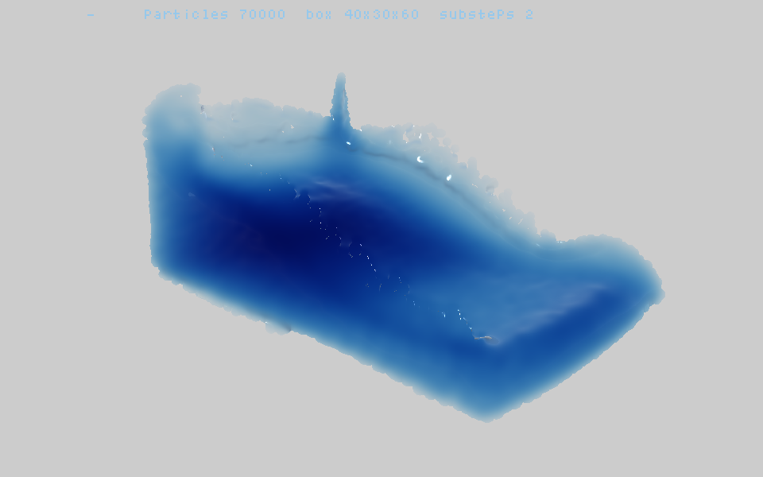
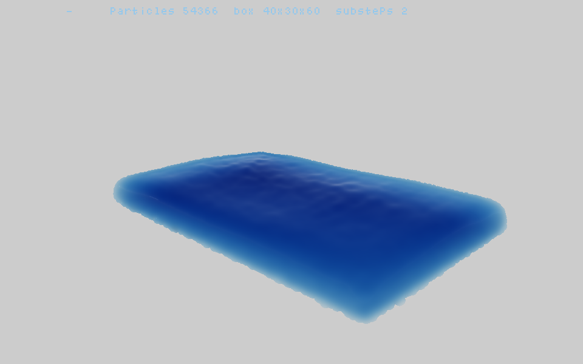
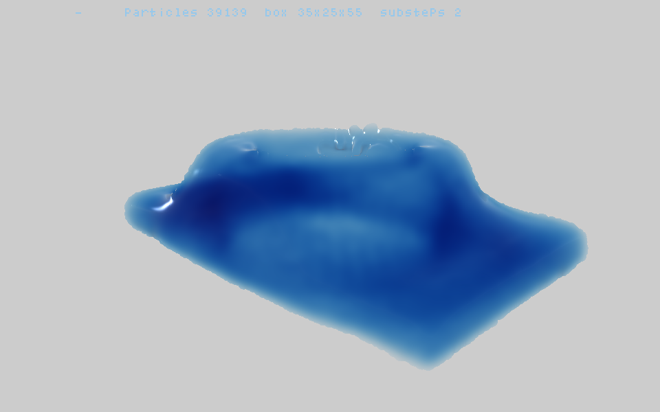
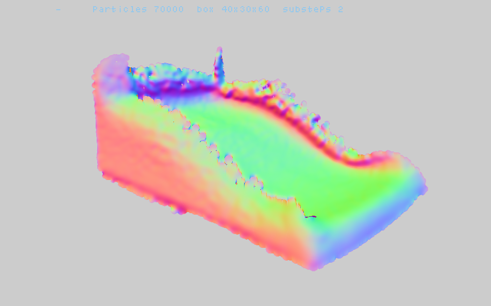

# umi_emu_cpp

3次元の水のシミュレータ。[webgpu-ocean](https://github.com/matsuoka-601/webgpu-ocean) を
**GPU を使わず C++ だけで**。Emscripten で WASM にして走らせます。
作りは [hanabi_emu_cpp](https://github.com/yomei-o/hanabi_emu_cpp) /
[taki_emu_cpp](https://github.com/yomei-o/taki_emu_cpp) と同じ ABI・同じハーネス。

## ▶ WASM デモ

### **https://yomei-o.github.io/umi_emu_cpp/wasmdist/umi_os/**



ダムブレイク（7万粒子・箱 40×30×60）。本家 `mlsmpmInitBoxSizes[1]` と同じ箱・同じ粒子数・同じカメラ。

| | |
|---|---|
|  |  |
| 静かな海面（水槽） | 飛沫（水塊を落とす） |

---

# 一度目は「球体」になった — 何が違っていたか

最初の版は MLS-MPM の教科書どおりに書きました。動いてはいたのですが、
**本家は2万粒子でも海に見えるのに、こちらは水が塊に丸まる**。
本家のソースを定数まで読み直したら、5か所で別物をやっていました。

| | 一度目（教科書どおり） | 本家 = 今の版 | 症状 |
|---|---|---|---|
| **単位** | メートル・秒（dx=5cm, g=9.8） | **格子1マス = 1**（dx=1, g=0.3, dt=0.20） | ― |
| **圧力** | 体積比 J から `E·(J−1)`、E=400 | **格子から測った密度の Tait**<br>`max(0, 3·((ρ/4)⁵−1))` | **J 方式は負圧＝引力を持つ。<br>水が自分を丸めて塊になる**（これが「球体」の正体） |
| **音速と流速の比** | c=20, v≈4.4 → **マッハ0.2** | c≈1.9, v≈4 → **マッハ2** | 教科書の水は硬すぎる。dt が小さくなり、<br>1フレームで**ほとんど動かない**（飴のよう） |
| **粘性** | なし | **`stress += 0.1·(C + Cᵀ)`** | 表面が毛羽立つ |
| **箱の形** | 40×20×26（浅い平鍋） | **40×30×60（奥に長い水槽）** | 奥行きが幅の1.5倍あって 45°から見下ろすから<br>「海面の広がり」が出る |
| **厚み（吸収）** | 手前の粒子だけ足す | **内部の粒子も全部足す** | 厚い所が薄く出て色が合わない |

**負圧を捨てる1行**（`max(0, …)`）が効きます。水は押し返すが引っ張らない。だから丸まらない。

## 物性 — 本家 `mls-mpm/mls-mpm.ts` の constants をそのまま

```
stiffness = 3.0     rest_density = 4.0     dynamic_viscosity = 0.1
dt = 0.20           gravity = 0.3          substeps/frame = 2
粒子間隔 = 0.65 マス（→ 1マスあたり 1/0.65³ = 3.64 個 ≒ rest_density）
```

## なぜ CPU で足りるのか — MLS-MPM

本家が SPH をやめて MLS-MPM に替えた理由がそのまま効きます。**近傍探索が要らない。**

| | 1粒子あたりの仕事 |
|---|---|
| SPH | 半径内の近傍を探す（探索そのものが高い） |
| **MLS-MPM** | **3×3×3 の格子を触るだけ。固定。分岐なし** |

本家の compute pass と1対1で並んでいます。

```
clearGrid    格子を消す
P2G 1        質量と運動量を撒く。APIC の Q = C·(節点−粒子) を一緒に運ぶ
P2G 2        格子から密度を測り直す → Tait で圧力 → 応力 → もう一度撒く
             ★体積を毎ステップ測り直すのが、この dt を許している理由（nialltl の記事）
updateGrid   v /= m、重力、壁で速度成分を落とす
G2P          速度と C を集め直し、位置を進め、壁のバネで押し返す
```

## 描画 — 画面空間の流体レンダリング

粒子を一個ずつ球として描くのではなく、**深度をならしてから法線を作る**のがこの手法の肝です。
本家 `render/*.wgsl` と `render/fluidRender.ts` の定数をそのまま使っています。

1. **深度** 粒子を球のインポスタとして撒き、いちばん手前の視空間深度だけ残す
2. **平滑化** 双方向フィルタ（bilateral）を**分離型で4往復**。窓の幅は深度に反比例
   （`filter_size = 1.2 × 画面上の球の半径[px]`、深度差の σ は `半径·10/3`）
3. **法線** ならした深度から視空間の位置を復元し、差分の外積で法線を作る。
   左右・上下それぞれ **z の差が小さいほうの差分を選ぶ**（シルエットで法線が寝ないように）
4. **厚み** 深度テスト無しで **全粒子** の `0.05 · √(1−r²)` を足し、σ≈8px で大きくぼかす
5. **着色** 本家 `render/fluid.wgsl` の式をそのまま：

```
bgColor       = 0.8                                  // 平らな灰。屈折でずらしたりしない
diffuseColor  = (0.085, 0.6375, 0.9)
transmittance = exp(-1.5 · thickness · (1 - diffuseColor))
              = exp(-1.5 · thickness · (0.915, 0.3625, 0.1))
refraction    = bgColor · transmittance
fresnel       = 0.02 + 0.98 · (1 - dot(n, -rayDir))^5
specular      = pow(dot(H, n), 250),  H = normalize(lightDir - rayDir), lightDir = ワールド (0,0,-1)
final         = specular + mix(refraction, reflection, fresnel)
```

**水の青は色を塗っていません。** 赤が青の 9 倍速く吸われた結果です。
`diffuseColor` の青が 0.9 なので消散係数は 0.1 ── 赤(0.915)の 1/9 しか吸われない。
だから厚くなっても黒ではなく濃い群青で止まります。

**反射は青空ではありません。** 本家の cubemap は
*"Industrial Sunset 02 (Pure Sky)"*（polyhaven, CC0）＝ **海の上の夕暮れ**。
上は青、地平は白く霞み、下は鋼色の水面、地平の一方向に橙の太陽。
本家の絵に出ている「水面を走る暖色の筋」はこれの映り込みです。ここは写真を持たずに手続きで作っています。



法線表示（`表示 → 法線`）。粒の凹凸が消えて、なめらかな水面の法線になっていることの確認に使います。

## CPU で間に合わせるためにやったこと

内訳を測って、効く順に潰しました（**推測しないで毎段の時間を出す**のが一番効きました）。

| 手 | 効果 |
|---|---|
| **格子を (vx,vy,vz,m) の4つ組で持って SIMD 化** — 1節点 = 1ベクタ。27節点のループが load/fma/store 各1回 | MPM 21 → 12 ms |
| 深度の**厳密な早期打ち切り** — 球のいちばん手前でも既存の深度より奥なら、その画素は絶対に更新されない。`sqrt` に入る前に切る。手前から撒くとよく効く | depth 18 → 7 ms |
| 双方向フィルタの空間側の重みを**窓幅ごとに表引き** | filter 11 → 8 ms |
| 流体だけ**半解像度**で描いて最後に拡大（`解像度` で全解像度にも切替可） | 深度・平滑化・着色が 1/4 |
| 厚みは**1/4 解像度**（どうせ σ≈8px でぼかす） | ほぼタダに |
| `expf` / `sqrt` を**表引き**に | 毎画素で何度も呼ぶとそこだけで数十 ms |
| 粒子を**セル順に並べ替え**（計数ソート、8フレームに1回） | 27節点がキャッシュに載ったままになる |

**前の版の「内部の粒子を描かない」間引きは捨てました。** 質量格子の6近傍で判定していたので
表面の粒子まで落ちて**水面に穴が空いていた**（それが粒っぽさの一因）。
上の早期打ち切りは同じ効果を厳密に、しかも速く出します。

### 実測

ネイティブ -O3（1コア）/ WASM SIMD128、ダムブレイク 120フレーム目、半解像度。

| lv | 箱 | 粒子数 | ネイティブ | WASM | 内訳（ネイティブ） |
|---|---|---|---|---|---|
| 0 | 30×22×45 | 20,000 | 24 ms | 30 ms | MPM 6.3 / depth 4.1 / filter 7.7 / shade 5.9 |
| **1** | **35×25×55** | **40,000** | **35 ms** | **44 ms** | MPM 12.6 / depth 6.7 / filter 8.3 / shade 7.0 |
| 2 | 40×30×60 | 70,000 | 50 ms | 62 ms | MPM 23.4 / depth 10.6 / filter 8.6 / shade 7.8 |
| 3 | 45×40×80 | 120,000 | 72 ms | 83 ms | MPM 42.2 / depth 15.0 / filter 7.2 / shade 8.0 |
| 4 | 50×50×80 | 200,000 | 139 ms | 131 ms | MPM 88.3 / depth 28.7 / filter 10.6 / shade 11.3 |

lv1〜lv4 の箱・粒子数・カメラ距離は本家 `main.ts` の 4 段そのままです（lv0 は CPU 用に足したもの）。

## 正直な差（本家との比較）

| | webgpu-ocean | これ |
|---|---|---|
| 粒子数（実用） | 10万〜30万（GPU） | **2万〜7万**（CPU 1コア） |
| 並列 | GPU 数千スレッド | WASM SIMD128 のみ |
| スレッド | ― | **GitHub Pages では使えない**（COOP/COEP ヘッダが無く SharedArrayBuffer 不可） |
| 反射 | 夕暮れの cubemap（写真） | 同じ色を手続きで |
| 深度バッファ | 全解像度 | 既定は半解像度（切替可） |

## ビルド

```bash
./build.sh umi_os        # → wasmdist/umi_os/{sim.js,sim.wasm}
```

ネイティブ自己テスト（PNG を書き出し、毎段の所要時間も出す）:

```bash
clang++ -O3 -std=c++17 -I. -o umi_test src/umi_os.cpp
./umi_test 120 umi.png                     # 引数: フレーム数 出力PNG
LEVEL=2 SCENE=0 RS=1 ./umi_test 40 out.png # 粒子数 / 場面(0ダム 1水槽 2飛沫) / 解像度の分母
```

環境変数: `LEVEL SCENE SUB AZ EL DIST RADIUS ABSORB SMOOTH MODE VISC RS SQUEEZE`
